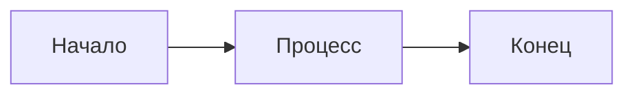

# Промпт для форматирования Markdown в стиле Material for MkDocs

При работе с файлами в папке `docs_src/` форматируй markdown согласно стандартам Material for MkDocs:

## Основные правила форматирования:

### 1. Заголовки и структура
- Используй четкую иерархию заголовков (H1 для главного, H2 для разделов, H3 для подразделов)
- Между разделами оставляй одну пустую строку
- Заголовки должны быть краткими и информативными

### 2. Admonitions (важные блоки)
Используй admonitions для выделения важной информации:

```markdown
!!! note "Заголовок"
    Текст заметки

!!! tip "Совет"
    Полезный совет

!!! warning "Внимание"
    Предупреждение

!!! danger "Осторожно"
    Критическая информация

!!! quote "Цитата"
    Цитата или важное высказывание

??? info "Раскрывающийся блок"
    Скрытая информация, раскрывается по клику
```

### 3. Таблицы
Форматируй таблицы с выравниванием:
```markdown
| Колонка 1 | Колонка 2 | Колонка 3 |
| --------- | :-------: | --------: |
| Текст     | Центр     | Справа    |
```

### 4. Код
- Используй тройные backticks с указанием языка
- Для inline кода используй одинарные backticks
- Добавляй пояснения к сложным блокам кода

```python
# Пример кода с пояснением
def example():
    return "code"
```

### 5. Списки
- Используй маркированные списки для перечислений
- Нумерованные списки для пошаговых инструкций
- Вложенные списки с правильными отступами (4 пробела)

### 6. Ссылки
- Внутренние ссылки на другие страницы: `[Текст](filename.md)`
- Внешние ссылки: `[Текст](https://example.com)`
- Используй макросы для переменных: `{{ SITE_DOMAIN }}`

### 7. Изображения
- Сохраняй изображения в папку `assets/`
- Используй относительные пути: ``
- Добавляй осмысленные alt-тексты

### 8. Mermaid диаграммы
Используй для визуализации архитектуры и процессов:


### 9. Emoji (опционально)
Можно использовать emoji для визуального выделения: :rocket: :warning: :bulb:

### 10. Стиль написания
- Пиши кратко и по делу
- Используй активный залог
- Разбивай длинные абзацы на короткие
- Используй выделение **жирным** для важных терминов
- Используй *курсив* для акцентов

## Пример хорошо отформатированного раздела:

```markdown
## Название раздела

Краткое введение в раздел.

!!! tip "Полезно знать"
    Дополнительная информация, которая поможет пользователю.

### Подраздел

Основной текст с пояснениями.

| Параметр | Описание | Значение |
| -------- | -------- | -------- |
| Параметр 1 | Описание 1 | Значение 1 |
| Параметр 2 | Описание 2 | Значение 2 |

Для настройки используй:

```python
# Пример кода
config = {
    "param": "value"
}
```

Следующие шаги:

1. Первый шаг
2. Второй шаг
3. Третий шаг
```

## При форматировании всегда:
- Сохраняй YAML frontmatter в начале файла (если есть)
- Используй современные возможности Material for MkDocs
- Делай текст читаемым и структурированным
- Проверяй, что все ссылки корректны
- Используй admonitions для важной информации
- Форматируй код с указанием языка

