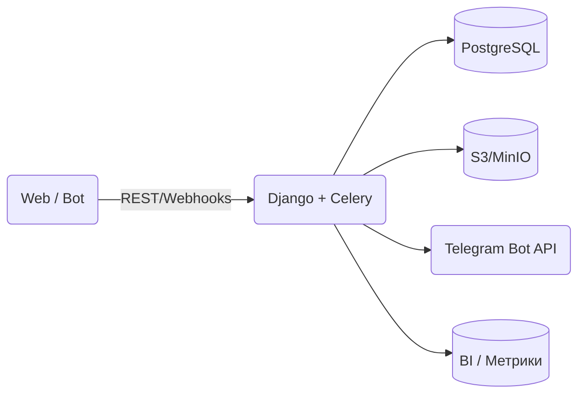

{{ hero("SGU.Events", "единая точка входа в цифровые события университета") }}

Платформа живёт на домене [{{ SITE_DOMAIN }}]({{ SITE_DOMAIN }}) и объединяет онлайн и офлайн-активности для студентов, преподавателей и партнёров.

## Быстрые ссылки

- [Регистрация](registration.md)
- [Руководство пользователя](user_guide.md)
- [Телеграм-бот]({{ TG_BOT_URL }})
- [Возможности платформы](features.md)
- [Руководство для организаторов](organizers.md)
- [Гайд для администраторов](admins.md)

## Что внутри

??? tip "Ключевые компоненты платформы"
    - **Веб-портал** — основной UI, доступный через браузер.
    - **Телеграм-бот** — быстрый канал уведомлений и действий для мобильного сценария.
    - **Back-office** — Django admin и специализированные панели для контент-менеджеров.

!!! quote "Миссия"
    SGU.Events упрощает доступ к мероприятиям, автоматизирует документооборот и собирает аналитику посещаемости в одном месте.

## Архитектура на пальцах

### Точки интеграции

| Направление        | Описание                                   |
| ------------------ | ------------------------------------------ |
| Telegram           | Уведомления, быстрые подтверждения заявок  |
| Внутренние сервисы | LDAP/SSO для авторизации, реестр кафедр    |
| BI                 | Экспорт статистики для руководства         |

## Минимальные требования

- Современный браузер (Chrome/Edge/Safari последних двух версий).
- Поддержка TLS 1.2+ (включено на CDN).
- Для бота — Telegram 8.0+ на iOS/Android/Desktop.

## Что дальше

1. Пройдите [регистрацию](registration.md) и настройте профиль.
2. Подключите [телеграм-бота](telegram_bot.md), чтобы не пропускать уведомления.
3. Изучите [основные функции](features.md) и углубитесь в разделы для своей роли.

