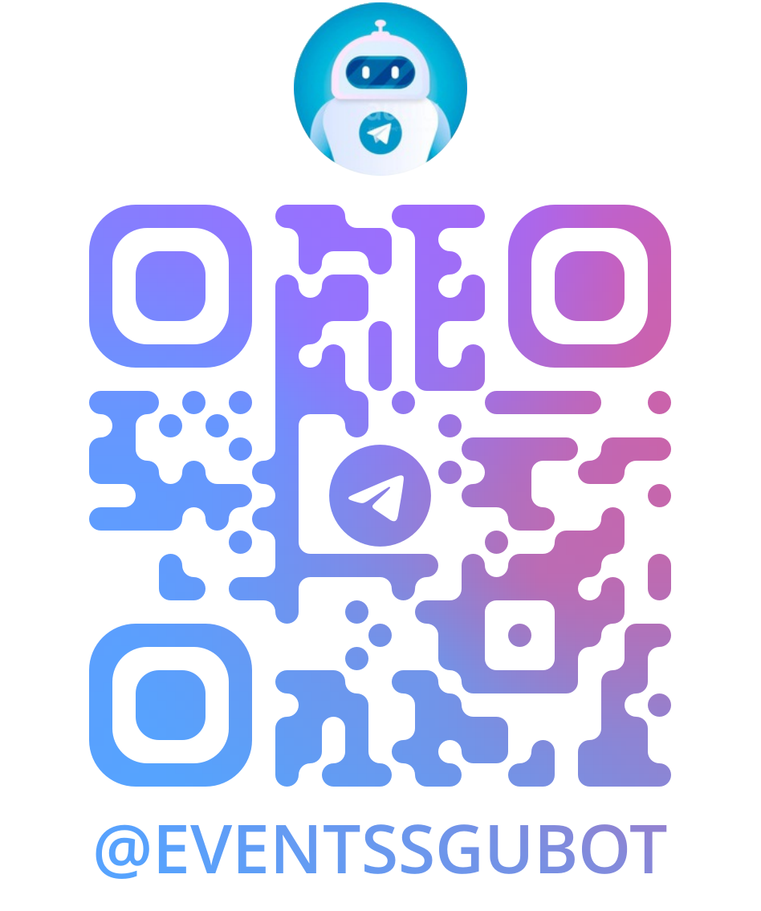
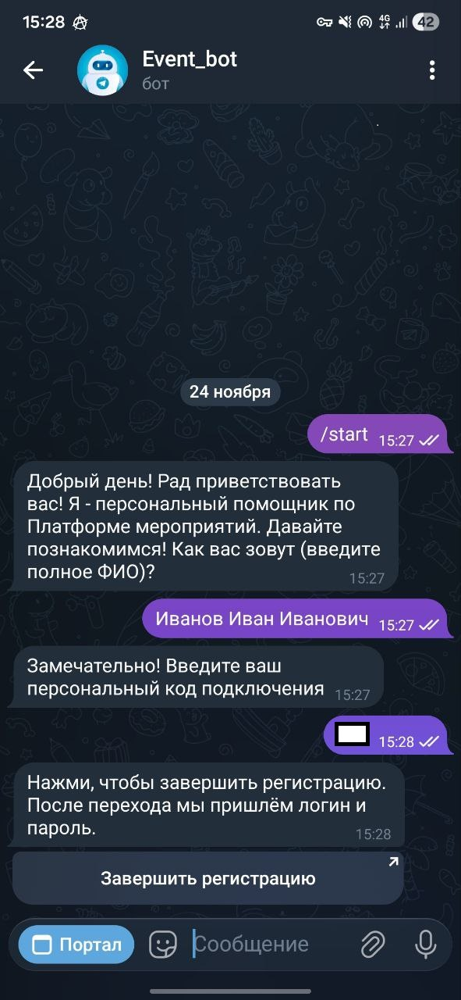
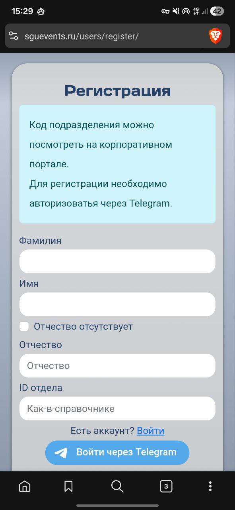
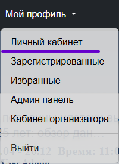
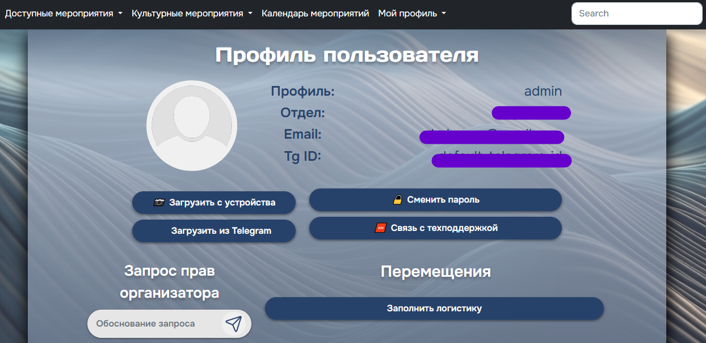

!!! note "Регистрация занимает ~2 минуты"
    Для регистрации нужен активный аккаунт Telegram, ФИО и код подразделения, который выдаётся индивидуально при направлении приглашения на платформу. Данный код запрещено передавать третьим лицам.

## 1. Регистрация на портале (через бота Telegram)

1. Откройте [бота]({{ TG_BOT_URL }}) и нажмите `Старт`.
   { style="max-width: 400px; max-height: 500px;" }
2. Следуйте инструкциям бота. Введите ФИО и код подразделения.
3. Перейдите по полученной ссылке для завершения регистрации.
4. Регистрация завершена.
   
   { style="max-width: 400px; max-height: 500px;" }

!!! success "Готово"
    После завершения регистрации бот начнёт отправлять мгновенные уведомления о регистрациях, изменениях в мероприятиях, чек-листах и сообщения от организаторов мероприятий.

## 2. Регистрация через форму на сайте (альтернативный способ)

1. Перейдите на [{{ SITE_DOMAIN }}/users/register]({{ SITE_DOMAIN }}/users/register).
2. Заполните ФИО и код подразделения.
3. Авторизуйтесь через свой аккаунт Telegram.
4. Логин и пароль придёт от бота в привязанный аккаунт Telegram.
   
   { style="max-width: 400px; max-height: 500px;" }

## 3. Настройка профиля

{ style="max-width: 400px; max-height: 500px;" }

- **Добавьте фото** — чтобы организаторам было проще идентифицировать посетителей.
- **Запросите права** — при необходимости запросите права администратора, указав причину.
- **Техническая поддержка** — отправьте сообщение в техническую поддержку.
- **Логистика** — просмотрите или отредактируйте данные по логистике ваших мероприятий (гостиницы, рейсы, трансфер).
  { style="max-width: 400px; max-height: 500px;" }

## 4. Роли и заявки

| Роль          | Как получить                                                       |
| :------------ | :----------------------------------------------------------------- |
| **Участник**  | Назначается автоматически после регистрации                        |
| **Организатор** | Подайте заявку через личный кабинет                               |
| **Администратор** | Подайте заявку через личный кабинет                               |

## Частые вопросы

??? question "Можно ли зарегистрироваться без привязки Telegram?"
    Нет, привязка аккаунта Telegram обязательна для работы платформы.

??? question "Что делать, если сменился аккаунт Telegram или номер телефона?"
    Обратитесь в техническую поддержку через личный кабинет или напишите администратору платформы.

??? question "Где найти код подразделения?"
    Код подразделения выдаётся индивидуально при направлении приглашения на платформу. Если у вас нет кода, обратитесь к организатору мероприятия или в техническую поддержку.

